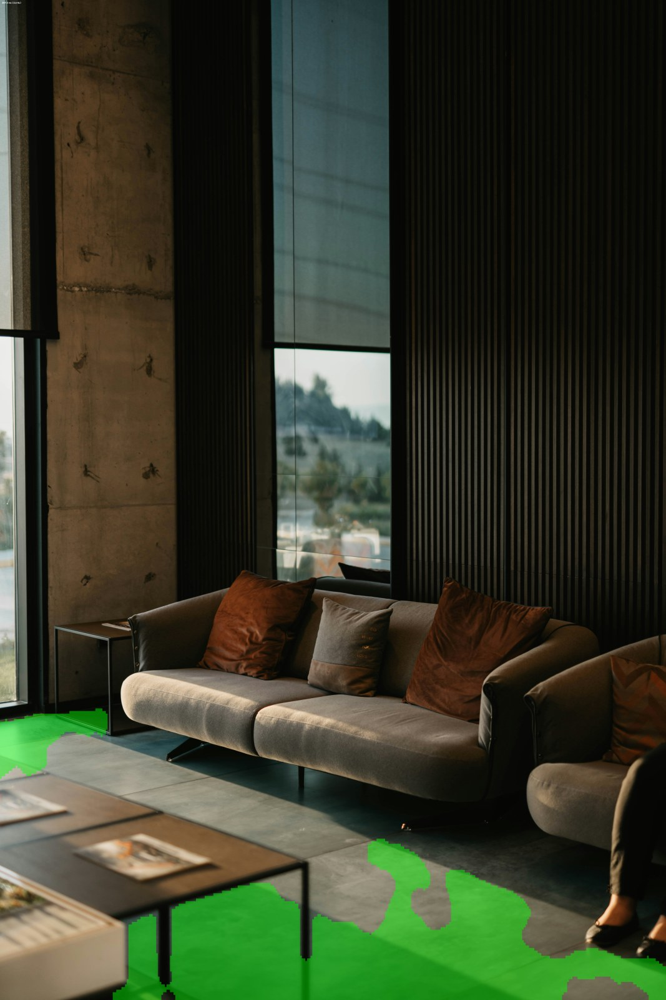
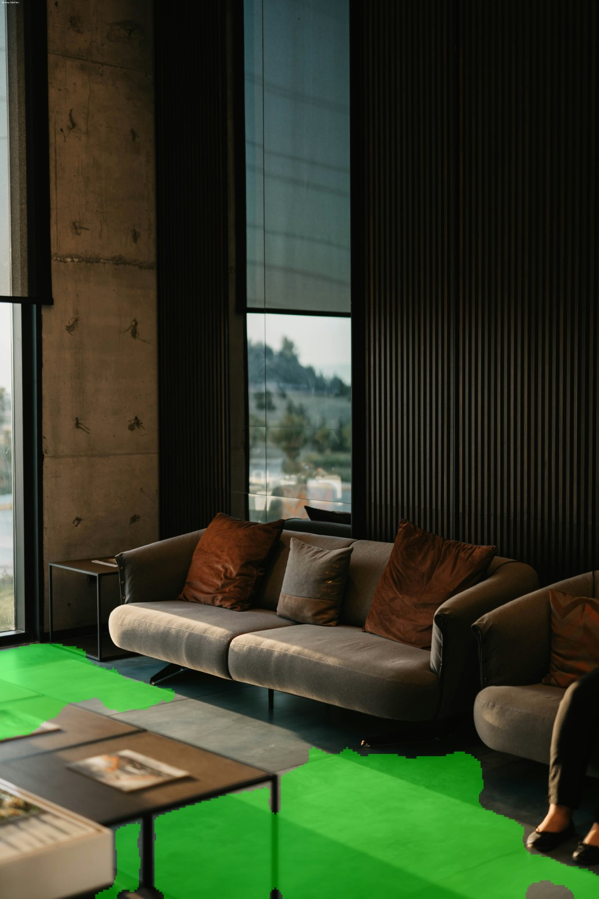

# Floor Segmentations

Real-time traversable-floor segmentation for autonomous cleaning robots,
targeting CPU-only deployment (with automatic NPU fallback where available)
via Intel OpenVINO.

## What's in this repo

```
scripts/
  export_to_onnx.py        # PyTorch checkpoint -> ONNX
  export_to_openvino.py    # ONNX -> OpenVINO IR, with optional INT8 quantization
  infer_openvino.py        # Inference with automatic NPU/CPU device detection
                            #   (works on a single image, a folder, or a video)
  evaluate_openvino_iou.py # IoU/Dice/precision/recall for an OpenVINO IR model
                            #   against the same held-out split used in
                            #   02_finetune_hand_annotated.ipynb
  test_onnx_video.py       # ONNX Runtime inference on video (used during
                            #   development before the OpenVINO pipeline existed)
  test_onnx_images.py      # ONNX Runtime inference on images/folders
  benchmark_onnx_video.py  # Timing-only benchmark, no output video written
notebooks/
  01_cv_augmented.ipynb                   # 5-fold cross-validation training
  02_finetune_hand_annotated.ipynb        # Fine-tuning on hand-annotated data
docs/
  benchmark_report.md
  writeup.md
checkpoints/
  fold_0/ ... fold_4/     # all 5 cross-validation fold checkpoints
                           #   (best.pt, last.pt, history.csv, summary.json each)
  cv_summary.json          # aggregate metrics across all 5 folds
  Offline_Fine_tuned/      # the fine-tuned checkpoint used for the reported
                           #   results (best.pt, last.pt, history.csv,
                           #   manifest.csv, summary.json) — fine-tuned from
                           #   fold_0, the highest-IoU fold
onnx/
  floor_seg_model.onnx     # ONNX export of the fine-tuned checkpoint
openvino/
  fp32/floor_seg_model.{xml,bin}   # OpenVINO IR, no quantization
  int8/floor_seg_model.{xml,bin}   # OpenVINO IR, INT8 quantized
overlays/
  fp32/*.png                # sample segmentation outputs, FP32 IR
  int8/*.png                # sample segmentation outputs, INT8 IR
data/
  floor_seg_data/{images,masks,ignore_masks}/  # empty — place hand-annotated
                                                #   data here (see below)
```

## What's included vs. not included

**Included:** all 5 cross-validation fold checkpoints (`checkpoints/fold_0`
through `fold_4`, plus `cv_summary.json`), the fine-tuned checkpoint used
for the reported results (`checkpoints/Offline_Fine_tuned/`), the ONNX
export, both OpenVINO IR precisions (FP32 and INT8), and sample overlay
outputs for both — so the pre-built artifacts can be used directly with
`scripts/infer_openvino.py` or `scripts/evaluate_openvino_iou.py` without
re-running training/export yourself.

**Not included:** the hand-annotated dataset (`data/floor_seg_data/`) is a
large set of binary image/mask files, not committed to this repo. The
directory structure is included (via `.gitkeep`) so
`02_finetune_hand_annotated.ipynb` resolves paths correctly once
populated, if you want to re-run fine-tuning yourself rather than use the
included checkpoint.

- **Fine-tuning source checkpoint:** `checkpoints/fold_0/best.pt` is the
  highest-IoU cross-validation fold (0.8020, the best of the 5) — this is
  what `02_finetune_hand_annotated.ipynb` fine-tunes from, and it's
  already included in this repo.
- **Hand-annotated data:** `images/` (JPEG), `masks/` (binary PNG,
  0=background/255=floor), `ignore_masks/` (PNG, 255=uncertain/excluded
  from loss) — see `02_finetune_hand_annotated.ipynb`'s data-loading cells
  for the exact expected format.

## Setup

Tested on WSL2 Ubuntu (training/fine-tuning) and should run on any Linux/
Windows machine with Python 3.10+ for the deployment scripts.

### Training / fine-tuning (Colab or local GPU)

```bash
pip install torch torchvision albumentations==1.4.15 opencv-python-headless==4.10.0.84 \
    onnx onnxruntime tqdm pandas scikit-learn scikit-image

# albumentations==1.4.15 needs a specific albucore version, not whatever
# pip resolves by default:
pip uninstall -y albumentations albucore
pip install --no-cache-dir "albucore==0.0.15"
pip install --no-cache-dir --no-deps "albumentations==1.4.15"
```

### Deployment / inference (ONNX export, OpenVINO conversion, running inference)

```bash
pip install torch torchvision onnx onnxruntime opencv-python-headless numpy

# OpenVINO + quantization. The version pin matters: newer nncf (3.x) is
# NOT compatible with openvino 2024.6 (raises
# "AttributeError: module 'openvino' has no attribute 'Node'" during
# INT8 quantization).
pip install "openvino==2024.6.0" "nncf==2.14.1"
```

## Running the pipeline end-to-end

### 1. Export a trained checkpoint to ONNX

```bash
python scripts/export_to_onnx.py \
    --checkpoint path/to/best.pt \
    --output artifacts/floor_seg_model.onnx \
    --input-size 384
```

This constructs the exact MobileNetV3-UNet architecture used in training,
loads the checkpoint's state dict, and warns (with a confirmation prompt)
if any keys don't match — so a mismatched checkpoint can't be silently
exported wrong. It also numerically verifies the exported ONNX model
against the original PyTorch model's output before declaring success.

### 2. Convert to OpenVINO IR (FP32, or INT8 with quantization)

```bash
# FP32 IR, no quantization — fast, useful to confirm conversion works
python scripts/export_to_openvino.py \
    --onnx-model artifacts/floor_seg_model.onnx \
    --output-dir artifacts/openvino_model_fp32 \
    --precision FP32

# INT8 quantized — needed to reliably clear real-time CPU throughput.
# --calibration-dir should point at a folder of representative floor
# images (no labels needed); the training image folder works.
python scripts/export_to_openvino.py \
    --onnx-model artifacts/floor_seg_model.onnx \
    --output-dir artifacts/openvino_model_int8 \
    --precision INT8 \
    --calibration-dir data/floor_seg_data/images \
    --calibration-samples 300
```

### 3. Run inference (automatic NPU/CPU detection)

```bash
# Video
python scripts/infer_openvino.py \
    --model artifacts/openvino_model_int8/floor_seg_model.xml \
    --input path/to/video.mp4 \
    --output artifacts/segmented_output.mp4

# Single image or a folder of images
python scripts/infer_openvino.py \
    --model artifacts/openvino_model_int8/floor_seg_model.xml \
    --input path/to/image_or_folder \
    --output-dir artifacts/segmented_images
```

Device selection is automatic: the script checks
`openvino.Core().available_devices` at startup, uses `NPU` if present,
otherwise falls back to `CPU`. No manual switch needed. Pass `--device CPU`
or `--device NPU` to force a specific device (useful for side-by-side
benchmarking on NPU-equipped hardware).

Output includes per-frame preprocessing / inference / postprocessing
latency broken out separately, mean/max/P95 timing, effective Hz, and a
pass/fail check against a configurable real-time target
(`--hz-target`, default 2.0 Hz per the assignment spec).

### 4. Measure segmentation quality (IoU) for an OpenVINO IR model

```bash
python scripts/evaluate_openvino_iou.py \
    --model artifacts/openvino_model_int8/floor_seg_model.xml \
    --data-root data/floor_seg_data
```

Reproduces the exact held-out validation split used in
`02_finetune_hand_annotated.ipynb` (same seed, same 15% fraction), so the
resulting IoU/Dice/precision/recall are directly comparable to the
PyTorch checkpoint's reported numbers. Run this against both the FP32
and INT8 IR to measure quantization's actual accuracy impact — see
`docs/benchmark_report.md` for the real numbers from this repo's
checkpoint.

## Sample results

Two stages of the pipeline compared side by side, on the same two photos:

- **Trained with public datasets** — MobileNetV3-UNet cross-validated on
  ADE20K, SUN RGB-D, and NYUv2 subsets (`01_cv_augmented.ipynb`).
- **Fine-tuned with self-annotated data** — the checkpoint above, further
  trained on a small hand-annotated set (Hypersim synthetic renders and
  stock photos), targeting a false-positive
  failure mode observed in deployment (`02_finetune_hand_annotated.ipynb`).

|  | Trained with public datasets | Fine-tuned with self-annotated data |
|---|---|---|
| **Example A** |  |  |
| **Example B** |  |  |

See `docs/benchmark_report.md` for FP32-vs-INT8 quantization latency and
quality tradeoffs, and `docs/writeup.md` for the full discussion of what
the fine-tuning stage changed and its known limitations.

## Training / fine-tuning

`notebooks/01_cv_augmented.ipynb` — trains MobileNetV3-UNet with 5-fold
stratified group cross-validation on a mixed dataset (ADE20K,
SUN RGB-D, NYUv2 subsets filtered for floor visibility), using a
padding-safe resize (aspect-ratio-preserving instead of a hard resize)
plus scale/crop/rotation/coarse-dropout augmentation.

`notebooks/02_finetune_hand_annotated.ipynb` — fine-tunes the
cross-validated checkpoint on a small (~190-image) hand-annotated set
combining Hypersim synthetic renders and stock photos,
using an asymmetric loss that penalizes false positives more than false
negatives (targeting a specific observed failure mode — the model
incorrectly labeling parts of the robot's own chassis as floor). See
`docs/writeup.md` for the full rationale and known limitations of this
approach.

## Known limitations

See `docs/writeup.md` for the full discussion. Briefly: the fine-tuned
model shows strong improvement on data resembling its fine-tuning
distribution, but generalization to visually distinct floor types outside
that distribution has not been rigorously validated at the time of this
submission — this is a known open question, not a claimed strength.
